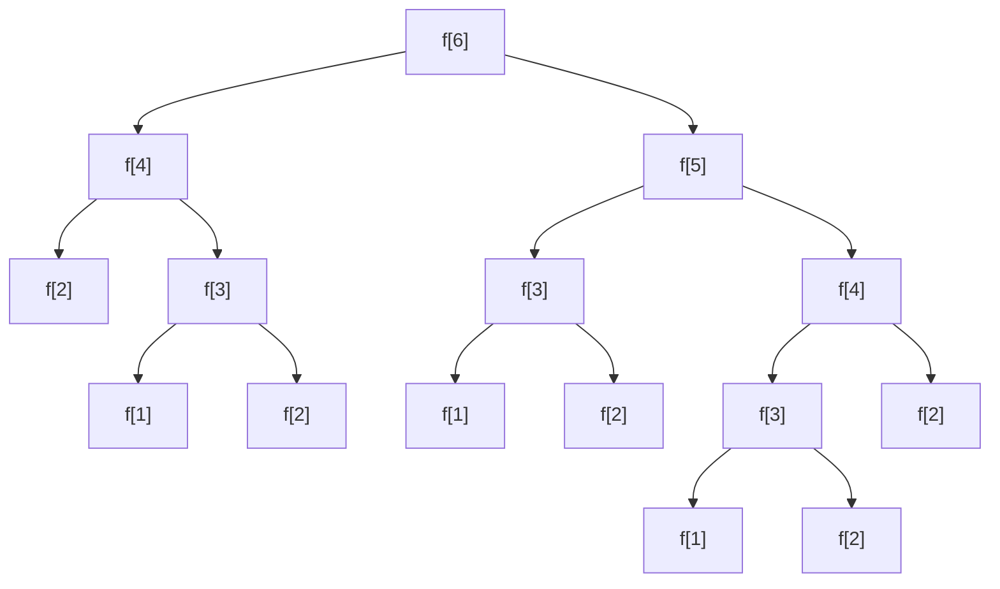
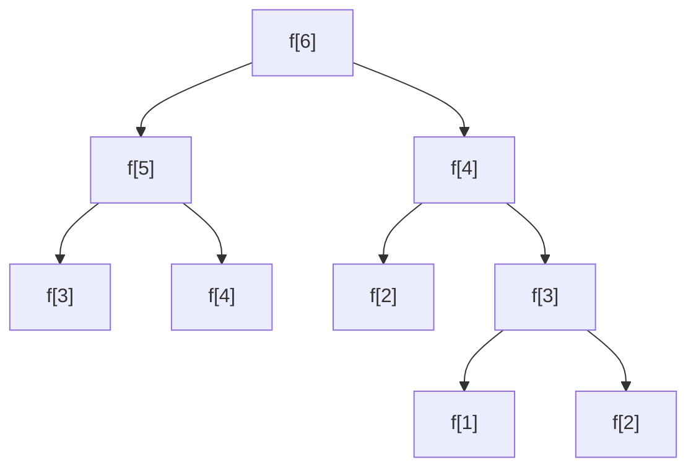

> [!NOTE]
>
> 初学者的疑惑：每次遇到新题自己怎么也想不出来，看一眼题解与转移方程，原来这么简单！我怎么没想到？

> [!TIP]
>
> 新手建议通过 [一本通](http://ybt.ssoier.cn:8088/) 练习

## 引例 1：斐波那契数列 Fibonacci

斐波那契数列：1,1,2,3,5,8,13,21.......

通项公式：$f_n=f_{n-2}+f_{n-1}$ (n>2)，其中$f_1=f_2=1$

输入：$n\in Z_+(n\leq 1000)$

输出：$f_n$ mod 10000

大家可以自己思考一下

### 方法一

:::collapse

- 建议自行思考一段时间哦~（点此查看代码）

  ```c++
  #include<cstdio>

  int n;

  int dp(int x) {
      if(x == 1 || x == 2) return 1;
      return (dp(x - 2) + dp(x - 1)) % 10000;
  }

  int main() {
      scanf("%d", &n);
      printf("%d\n", dp(n));
      return 0;
  }
  ```

:::

### 可以优化一下吗？



我们发现这个程序做了很多重复操作，我们对于重复的计算，完全可以使用前面已经计算过的

这样，我们的流程图就优化成了这样



### 改进一（记忆化搜索）

```c++
#include<cstdio>

int n, f[1005];

int dp(int x) {
	if(f[x]) return f[x];
    if(x == 1 || x == 2) return 1;
    return f[x] = (dp(x - 2) + dp(x - 1)) % 10000;
}

int main() {
    scanf("%d", &n);
    printf("%d\n", dp(n));
    return 0;
}
```

### 改进二（直接递推）

> [!TIP]
>
> 此方法比较常用

很显然，本题的转移方程为：$f_i=f_{i-1}+f_{i-2}\mod10000$

```c++
#include<cstdio>

int n, f[1005];

int main() {
    scanf("%d", &n);
    f[1] = f[2] = 1;
    for(int i = 3; i <= n; ++i)
    	f[i] = (f[i - 1] + f[i - 2]) % 10000;
    printf("%d\n", f[n]);
    return 0;
}
```

## 引例 2：[数字金字塔](http://ybt.ssoier.cn:8088/problem_show.php?pid=1258)

### 题目大意

有一个数字三角形，编程查找从最高点到底部任意处结束的路径，使路径经过数字的和最大。每一步可以从当前点走到左下方的点也可以到达右下方的点。输出这个最大值。

{height="300" weight="300"}

如上图，最大路径和为$7+3+8+7+5=30$

即：

{height="300" weight="300"}

### 输入样例

```
5
7
3 8
8 1 0
2 7 4 4
4 5 2 6 5
```

### 输出样例

```
30
```

### 方法一

定义$dfs(x, y)$为从$(x,y)$走到最后一行$(n,i)$所得到的的最大值

那么易得$dfs(x,y)=max(dfs(x+1,y),dfs(x+1,y+1))+a_{x,y}$.

++注意边界：$x=n$++{.dot}

#### 代码

```c++
int dfs(int x, int y) {
    if(x == n) return a[x][y];
    return max(dfs(x + 1, y), dfs(x + 1, y + 1)) + a[x][y];
}
```

> [!NOTE]
>
> 对于比较简单的思路，只给出主要代码（懒）

### 改进一

我们分析一下太慢的原因：

重复计算了很多的$dfs(x,y)$.

于是我们定义$f_{x,y}$用来记录$dfs(x,y)$，因为对于每一个$(x,y)$，走到最后一行的最大值是唯一的，我们只需要第一次走时记录最优值，再次用到时直接调用$f_{x,y}$即可

#### 代码

```c++
int dfs(int x, int y) {
    if(f[x][y]) return f[x][y];
    if(x == n) return f[x][y] = a[x][y];
    return f[x][y] = max(dfs(x + 1, y), dfs(x + 1, y + 1)) + a[x][y];
}
```

> [!NOTE]
>
> 特别注意，dfs 实际是从底部向上倒退的，可以自行模拟一下

### 改进二

直接从第 n 行向上递推（模拟 dfs 的过程）

定义$f_{i,j}$为从$(i,j)$走到最后一行的最大值

答案为$f_{1,1}$，初始化$f_{n,i}=a_{n,i}$.

```c++
for(int i = 1; i <= n; ++i) f[n][i] = a[n][i];
for(int i = n - 1; i; --i) {
    for(int j = 1; j <= i; ++j) {
        f[i][j] = max(f[i + 1][j], f[i + 1][j + 1]) + a[i][j];
    }
}
printf("%d\n", f[1][1]);
```

### 可以正向求解吗？

定义$f_{i,j}$为从$(1,1)$走到$(i,j)$的最大值

答案为$max(f_{n,i})$，初始化$f_{1,1}=a_{1,1}$.

```c++
f[1][1] = a[1][1];
for(int i = 2; i <= n; ++i) {
    for(int j = 1; j <= i; ++j) {
        f[i][j] = max(f[i - 1][j - 1], f[i - 1][j]) + a[i][j];
    }
}
for(int i = 1; i <= n; ++i) ans = max(ans, f[n][i]);
printf("%d\n", ans);
```

> [!NOTE]
>
> 引例结束，进入正题

## 动态规划

### 基本概念

- 动态规划（Dynamic Programming 简称 DP）。
- 解决“多阶段决策问题”的一种高效算法。
- 通过合理组合子问题的解从而解决整个问题解的一种算法。其中的子问题并不是独立的，这些子问题又包含有公共的**子子**问题。……
- 动态规划算法就是对每个子问题只求一次，并将其结果保存在一张表中(数组)，以后再用到时直接从表中拿过来使用，避免重复计算相同的子问题。
- "不做无用功"的求解模式，大大提高了程序的效率。
- 动态规划算法常用于解决统计类问题（统计方案总数）和最优值问题（最大值或最小值），尤其普遍用于最优化问题。

### 术语

1. 阶段： 把所给求解问题的过程恰当地分成若干个相互联系的阶段，以便于按一定的次序去求解，过程不同，阶段数就可能不同．描述阶段的变量称为阶段变量。在多数情况下，阶段变量是离散的，用 k 表示。
   **阶段的划分一般根据时间和空间来划分的。**
2. 状态：某一阶段的出发位置成为状态，通常一个阶段有多个状态。状态通常可以用一个或一组数来描述，称为状态变量。
3. 决策：一个阶段的状态给定以后，从该状态演变到下一阶段某个状态的一种选择（行动）称为决策。描述决策的变量称决策变量。
4. 策略和最优策略所有阶段的决策有序组合构成一个策略。最优效果的策略叫最优策略。

> [!NOTE]
>
> 这个并没有那么重要啦...

### 条件

- 拓扑图（有向无环图、DAG 图）
- 无后效性（即后面的改变不会影响前面）
- 最优子结构（所求）

### 步骤

1. 根据时间或空间确定要求的状态
2. **写动态转移方程**
3. 求解

### dp 常见题型

- 坐标型
- 线性型
- 区间型
- 背包型
- 树型

### 坐标型

在二维坐标系内，规定了方向，求最优值问题。

比较容易根据方向写出动态规划方程

一般方程也是二维的$f_{i,j}$.

#### 例 1：公共汽车

##### 问题描述

一个城市的道路，南北向的路有 n 条，由西向东从 1 标记到 n,东西向的路有 m 条，从南向北从 1 标记到 m,每一个交叉点代表一个路口，有的路口有正在等车的乘客。

一辆公共汽车将从(1,1)点驶到（n,m）点，车只能向东或者向北开.

问：司机怎么走能接到最多的乘客。

{height="50%" weight="50%"}

##### 输入

一行三个正整数 n,m,k

其中 k 是有乘客的路口的个数。以后 k 行是有乘客的路口的坐标和乘客的数量。已知每个路口的乘客数量不超过 1000000。$n,m\leq 1000$.

##### 输出

接到的最多的乘客数

##### 样例输入

```
8 7 11
4 3 4
6 2 4
2 3 2
5 6 1
2 5 2
1 5 5
2 1 1
3 1 1
7 7 1
7 4 2
8 6 2
```

##### 样例输出

```
11
```

##### 思路

定义$a_{i,j}$为$(i,j)$位置的人数，$f_{i,j}$为从$(1,1)$走到$(i,j)$能接的最多人数

**转移方程**：$f_{i,j}=max(f_{i-1,j},f_{i,j-1})+a_{i,j}$.

```c++
for(int i = 1; i <= m; ++i) {
    for(int j = 1; j <= n; ++j) {
        f[i][j] = max(f[i - 1][j], f[i][j - 1]) + a[i][j];
    }
}
printf("%d\n", f[m][n]);
```

#### 练习题

[ybt1284：摘花生](http://ybt.ssoier.cn:8088/problem_show.php?pid=1284)

[ybt1287：最低通行费](http://ybt.ssoier.cn:8088/problem_show.php?pid=1287)

### 线性型

**LIS** (Longest Increasing Subsequence）最长上升子序列：给定 n 个元素的数列，求最长的上升子序列长度(LIS)。

#### 例题：[最长上升子序列](http://ybt.ssoier.cn:8088/problem_show.php?pid=1281)

##### 问题描述

一个数的序列$b_i$，当$b_1<b_2<...<b_S$的时候，我们称这个序列是上升的。对于给定的一个序列$a_1,a_2,\dots,a_N$，我们可以得到一些上升的子序列$a_{i1},a_{i2},\dots,a_{iK}$，这里$1\leq i1<i2<\dots<iK\leq N$。比如，对于序列$(1,7,3,5,9,4,8)$，有它的一些上升子序列，如$(1,7)$,$(3,4,8)$等等。这些子序列中最长的长度是 4，比如子序列$(1,3,5,8)$。

你的任务，就是对于给定的序列，求出最长上升子序列的长度。

##### 思路

每个数向后面比他大的点建立有向边，求最长路（顶点数最多）

就有$f_i=max(f_j)+1(i<j\leq n\&\&a_i<a_j)$.

##### 方法一：暴力搜索

找出以每个元素为起点的所有的上升子序列，然后选择最长的即可。

```c++
int dfs(int i) {
    //求以a[i]开头的最长上升子序列长度
    int s = 0;
    for(int j = i + 1; j <= n; ++j)
        if(a[i] < a[j]) s = max(s, dfs(j));
    return ++s;
}
```

于是我们获得了 20pts 的好成绩

##### 方法二：记忆化搜索

我们发现以每个元素为起点的 LIS 是固定不变的，每次求完可以记录下来，供后面直接使用，避免重复搜索。

定义$f_i$为以$a_i$开始的最长上升子序列长度

```c++
int dfs(int i) {
    if(f[i]) return f[i];
    for(int j = 1; j <= n; ++j)
        if(a[i] < a[j]) f[i] = max(f[i], dfs(j));
    return ++f[i];
}
```

##### 方法三：倒序递推

观察边的顺序：$a_i$向后面的边$i+1,i+1,\dots,n$中选择。

可以直接倒序求。

初始化$f_n=1$.

**转移方程**：$f_i=max(f_j)+1(i<j\leq n\&\&a_i<a_j)$.

```c++
f[n] = 1;
for(int i = n - 1; i; --i) {
    for(int j = i + 1; j <= n; ++j)
        if(a[i] < a[j]) f[i] = max(f[i], f[j]);
    ++f[i];
}
```

##### 方法四：正向递推

定义$f_i$为以$a_i$为终点元素的最长上升子序列长度

初始化$f_1=1$.

**转移方程**：$f_i=max(f_j)+1(j<i\leq n\&\&a_j<a_i)$.

```c++
f[1] = 1;
for(int i = 2; i <= n; ++i) {
    for(int j = 1; j < i; ++j)
        if(a[j] < a[i]) f[i] = max(f[i], f[j]);
   	++f[i];
}
```

#### 知识扩展

- 最长上升子序列长度
- 最长不下降子序列长度
- 最长下降子序列长度
- 最长不上升子序列长度

#### 练习题

[ybt1264：合唱队型](http://ybt.ssoier.cn:8088/problem_show.php?pid=1264)

[ybt1283：登山](http://ybt.ssoier.cn:8088/problem_show.php?pid=1283)

[ybt1286：怪盗基德的滑翔翼](http://ybt.ssoier.cn:8088/problem_show.php?pid=1286)

[ybt1263：友好城市](http://ybt.ssoier.cn:8088/problem_show.php?pid=1263)

[ybt1260：导弹拦截](http://ybt.ssoier.cn:8088/problem_show.php?pid=1260)
