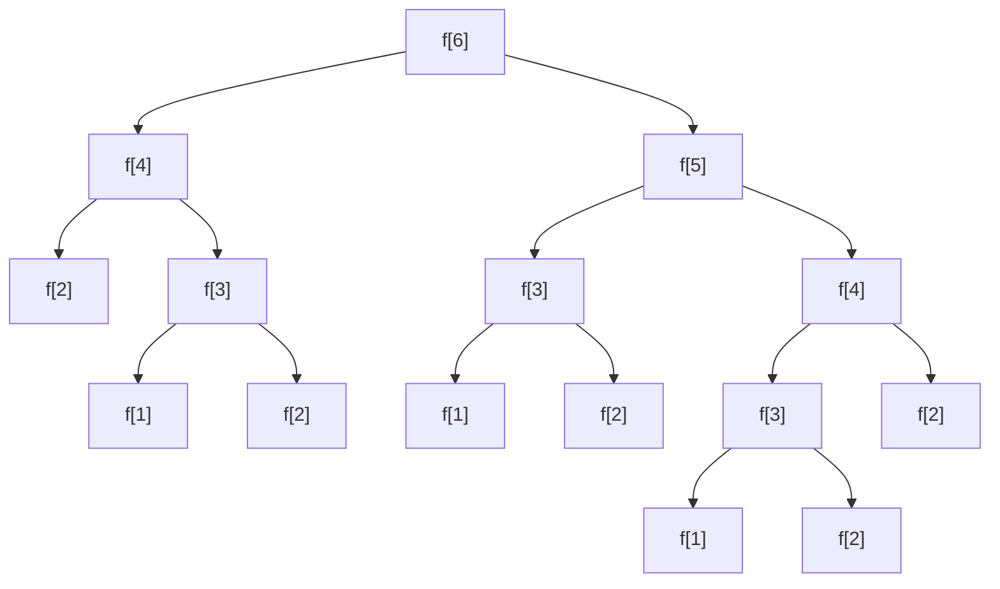
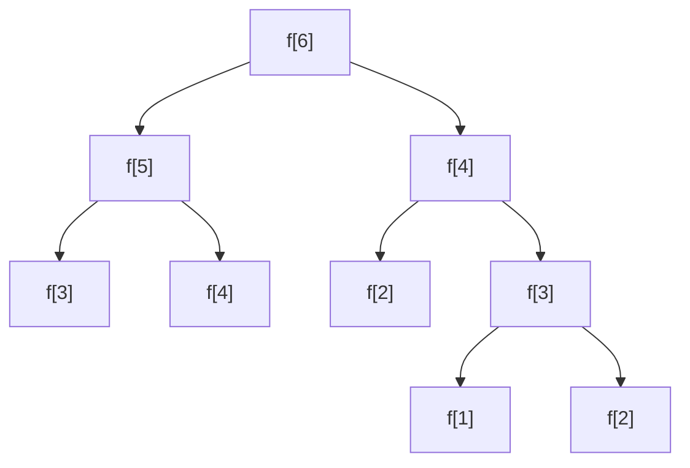

> [!NOTE]
>
> Beginner's confusion: Every time I encounter a new problem, I can't figure it out no matter how hard I try. But after glancing at the solution and the transition equation, it turns out to be so simple! Why didn't I think of that?

> [!TIP]
>
> Beginners are advised to practice through [Yibentong](http://ybt.ssoier.cn:8088/)

## Example 1: Fibonacci Sequence

Fibonacci sequence: 1,1,2,3,5,8,13,21.......

General formula: $f_n=f_{n-2}+f_{n-1}$ (n>2), where $f_1=f_2=1$

Input: $n\in Z_+(n\leq 1000)$

Output: $f_n$ mod 10000

Think about it yourself

### Method 1

:::collapse

- It's recommended to think about it for a while on your own~ (Click here to view the code)

  ```c++
  #include<cstdio>

  int n;

  int dp(int x) {
      if(x == 1 || x == 2) return 1;
      return (dp(x - 2) + dp(x - 1)) % 10000;
  }

  int main() {
      scanf("%d", &n);
      printf("%d\n", dp(n));
      return 0;
  }
  ```

:::

### Can we optimize this?



We find that this program performs many redundant operations. For repeated calculations, we can completely use the results already computed earlier.

This way, our flowchart is optimized to:



### Improvement 1 (Memoization)

```c++
#include<cstdio>

int n, f[1005];

int dp(int x) {
	if(f[x]) return f[x];
    if(x == 1 || x == 2) return 1;
    return f[x] = (dp(x - 2) + dp(x - 1)) % 10000;
}

int main() {
    scanf("%d", &n);
    printf("%d\n", dp(n));
    return 0;
}
```

### Improvement 2 (Direct Recursion)

> [!TIP]
>
> This method is more commonly used

Obviously, the transition equation for this problem is: $f_i=f_{i-1}+f_{i-2}\mod10000$

```c++
#include<cstdio>

int n, f[1005];

int main() {
    scanf("%d", &n);
    f[1] = f[2] = 1;
    for(int i = 3; i <= n; ++i)
    	f[i] = (f[i - 1] + f[i - 2]) % 10000;
    printf("%d\n", f[n]);
    return 0;
}
```

## Example 2: [Number Pyramid](http://ybt.ssoier.cn:8088/problem_show.php?pid=1258)

### Problem Description

There is a number triangle. Write a program to find the path from the top to any position at the bottom that maximizes the sum of numbers along the path. Each step can go from the current point to the lower-left point or to the lower-right point. Output this maximum value.

{height="300" weight="300"}

As shown above, the maximum path sum is $7+3+8+7+5=30$

That is:

{height="300" weight="300"}

### Sample Input

```
5
7
3 8
8 1 0
2 7 4 4
4 5 2 6 5
```

### Sample Output

```
30
```

### Method 1

Define $dfs(x, y)$ as the maximum value obtained from walking from $(x,y)$ to the last row $(n,i)$

Then we can easily get $dfs(x,y)=max(dfs(x+1,y),dfs(x+1,y+1))+a_{x,y}$.

++Note the boundary: $x=n$++{.dot}

#### Code

```c++
int dfs(int x, int y) {
    if(x == n) return a[x][y];
    return max(dfs(x + 1, y), dfs(x + 1, y + 1)) + a[x][y];
}
```

> [!NOTE]
>
> For relatively simple approaches, only the main code is provided (lazy)

### Improvement 1

Let's analyze why it's too slow:

Many $dfs(x,y)$ are calculated repeatedly.

So we define $f_{x,y}$ to record $dfs(x,y)$. Since for each $(x,y)$, the maximum value to reach the last row is unique, we only need to record the optimal value the first time we visit, and directly use $f_{x,y}$ when needed again.

#### Code

```c++
int dfs(int x, int y) {
    if(f[x][y]) return f[x][y];
    if(x == n) return f[x][y] = a[x][y];
    return f[x][y] = max(dfs(x + 1, y), dfs(x + 1, y + 1)) + a[x][y];
}
```

> [!NOTE]
>
> Note that dfs actually backtracks from bottom to top. You can simulate it yourself.

### Improvement 2

Directly recurse upward from row n (simulating the dfs process)

Define $f_{i,j}$ as the maximum value from walking from $(i,j)$ to the last row

The answer is $f_{1,1}$, initialize $f_{n,i}=a_{n,i}$.

```c++
for(int i = 1; i <= n; ++i) f[n][i] = a[n][i];
for(int i = n - 1; i; --i) {
    for(int j = 1; j <= i; ++j) {
        f[i][j] = max(f[i + 1][j], f[i + 1][j + 1]) + a[i][j];
    }
}
printf("%d\n", f[1][1]);
```

### Can we solve it forward?

Define $f_{i,j}$ as the maximum value from walking from $(1,1)$ to $(i,j)$

The answer is $max(f_{n,i})$, initialize $f_{1,1}=a_{1,1}$.

```c++
f[1][1] = a[1][1];
for(int i = 2; i <= n; ++i) {
    for(int j = 1; j <= i; ++j) {
        f[i][j] = max(f[i - 1][j - 1], f[i - 1][j]) + a[i][j];
    }
}
for(int i = 1; i <= n; ++i) ans = max(ans, f[n][i]);
printf("%d\n", ans);
```

> [!NOTE]
>
> End of examples, entering the main topic

## Dynamic Programming

### Basic Concepts

- Dynamic Programming (DP for short).
- An efficient algorithm for solving "multi-stage decision problems".
- An algorithm that solves the entire problem by reasonably combining solutions to subproblems. The subproblems are not independent; these subproblems contain common sub-subproblems. ……
- The dynamic programming algorithm solves each subproblem only once and saves its result in a table (array), so that it can be directly retrieved from the table when needed later, avoiding repeated calculations of the same subproblem.
- A solution model that "doesn't do useless work", greatly improving program efficiency.
- Dynamic programming algorithms are commonly used to solve statistical problems (counting total solutions) and optimal value problems (maximum or minimum values), especially prevalent in optimization problems.

### Terminology

1. Stage: Appropriately divide the given problem-solving process into several interconnected stages for solving in a certain order. Different processes may have different numbers of stages. The variable describing the stage is called the stage variable. In most cases, the stage variable is discrete, denoted by k.
   **Stage division is generally based on time and space.**
2. State: The starting position of a certain stage is called a state. Usually, a stage has multiple states. States can usually be described by one or a set of numbers, called state variables.
3. Decision: After the state of a stage is given, a choice (action) that evolves from that state to a certain state in the next stage is called a decision. The variable describing the decision is called the decision variable.
4. Strategy and Optimal Strategy: An ordered combination of decisions at all stages constitutes a strategy. The strategy with the optimal effect is called the optimal strategy.

> [!NOTE]
>
> This isn't that important...

### Conditions

- Topological graph (Directed Acyclic Graph, DAG)
- No aftereffect (i.e., later changes do not affect earlier ones)
- Optimal substructure (what we seek)

### Steps

1. Determine the required state based on time or space
2. **Write the dynamic transition equation**
3. Solve

### Common DP Problem Types

- Coordinate type
- Linear type
- Interval type
- Knapsack type
- Tree type

### Coordinate Type

In a two-dimensional coordinate system, with specified directions, find the optimal value problem.

It's relatively easy to write the dynamic programming equation based on the direction.

Generally, the equation is also two-dimensional $f_{i,j}$.

#### Example 1: Bus

##### Problem Description

The roads of a city: there are n north-south roads, marked from 1 to n from west to east, and m east-west roads, marked from 1 to m from south to north. Each intersection represents a junction, and some junctions have passengers waiting for the bus.

A bus will travel from point (1,1) to point (n,m). The bus can only go east or north.

Question: How should the driver go to pick up the most passengers?

{height="50%" weight="50%"}

##### Input

One line with three positive integers n, m, k

Where k is the number of junctions with passengers. The following k lines are the coordinates of junctions with passengers and the number of passengers. It is known that the number of passengers at each junction does not exceed 1000000. $n,m\leq 1000$.

##### Output

The maximum number of passengers picked up

##### Sample Input

```
8 7 11
4 3 4
6 2 4
2 3 2
5 6 1
2 5 2
1 5 5
2 1 1
3 1 1
7 7 1
7 4 2
8 6 2
```

##### Sample Output

```
11
```

##### Approach

Define $a_{i,j}$ as the number of people at position $(i,j)$, $f_{i,j}$ as the maximum number of people that can be picked up from walking from $(1,1)$ to $(i,j)$

**Transition equation**: $f_{i,j}=max(f_{i-1,j},f_{i,j-1})+a_{i,j}$.

```c++
for(int i = 1; i <= m; ++i) {
    for(int j = 1; j <= n; ++j) {
        f[i][j] = max(f[i - 1][j], f[i][j - 1]) + a[i][j];
    }
}
printf("%d\n", f[m][n]);
```

#### Practice Problems

[ybt1284: Picking Peanuts](http://ybt.ssoier.cn:8088/problem_show.php?pid=1284)

[ybt1287: Minimum Toll](http://ybt.ssoier.cn:8088/problem_show.php?pid=1287)

### Linear Type

**LIS** (Longest Increasing Subsequence): Given a sequence of n elements, find the length of the longest increasing subsequence (LIS).

#### Example: [Longest Increasing Subsequence](http://ybt.ssoier.cn:8088/problem_show.php?pid=1281)

##### Problem Description

A sequence of numbers $b_i$, when $b_1<b_2<...<b_S$, we call this sequence increasing. For a given sequence $a_1,a_2,\dots,a_N$, we can obtain some increasing subsequences $a_{i1},a_{i2},\dots,a_{iK}$, where $1\leq i1<i2<\dots<iK\leq N$. For example, for the sequence $(1,7,3,5,9,4,8)$, some of its increasing subsequences are $(1,7)$, $(3,4,8)$, etc. The longest length among these subsequences is 4, such as the subsequence $(1,3,5,8)$.

Your task is to find the length of the longest increasing subsequence for a given sequence.

##### Approach

Each number establishes a directed edge to numbers larger than it that come after it, find the longest path (maximum number of vertices)

So we have $f_i=max(f_j)+1(i<j\leq n\&\&a_i<a_j)$.

##### Method 1: Brute Force Search

Find all increasing subsequences starting with each element, then select the longest one.

```c++
int dfs(int i) {
    //Find the length of the longest increasing subsequence starting with a[i]
    int s = 0;
    for(int j = i + 1; j <= n; ++j)
        if(a[i] < a[j]) s = max(s, dfs(j));
    return ++s;
}
```

And so we achieved a good score of 20pts

##### Method 2: Memoization

We find that the LIS starting with each element is fixed and unchanging. After calculating it once, we can record it for direct use later, avoiding repeated searches.

Define $f_i$ as the length of the longest increasing subsequence starting with $a_i$

```c++
int dfs(int i) {
    if(f[i]) return f[i];
    for(int j = 1; j <= n; ++j)
        if(a[i] < a[j]) f[i] = max(f[i], dfs(j));
    return ++f[i];
}
```

##### Method 3: Reverse Recursion

Observe the order of edges: $a_i$ selects from edges to $i+1,i+1,\dots,n$ that come after it.

Can be solved directly in reverse order.

Initialize $f_n=1$.

**Transition equation**: $f_i=max(f_j)+1(i<j\leq n\&\&a_i<a_j)$.

```c++
f[n] = 1;
for(int i = n - 1; i; --i) {
    for(int j = i + 1; j <= n; ++j)
        if(a[i] < a[j]) f[i] = max(f[i], f[j]);
    ++f[i];
}
```

##### Method 4: Forward Recursion

Define $f_i$ as the length of the longest increasing subsequence ending with element $a_i$

Initialize $f_1=1$.

**Transition equation**: $f_i=max(f_j)+1(j<i\leq n\&\&a_j<a_i)$.

```c++
f[1] = 1;
for(int i = 2; i <= n; ++i) {
    for(int j = 1; j < i; ++j)
        if(a[j] < a[i]) f[i] = max(f[i], f[j]);
   	++f[i];
}
```

#### Knowledge Extension

- Longest increasing subsequence length
- Longest non-decreasing subsequence length
- Longest decreasing subsequence length
- Longest non-increasing subsequence length

#### Practice Problems

[ybt1264: Choir Formation](http://ybt.ssoier.cn:8088/problem_show.php?pid=1264)

[ybt1283: Mountain Climbing](http://ybt.ssoier.cn:8088/problem_show.php?pid=1283)

[ybt1286: Phantom Thief Kid's Glider](http://ybt.ssoier.cn:8088/problem_show.php?pid=1286)

[ybt1263: Friendly Cities](http://ybt.ssoier.cn:8088/problem_show.php?pid=1263)

[ybt1260: Missile Interception](http://ybt.ssoier.cn:8088/problem_show.php?pid=1260)
